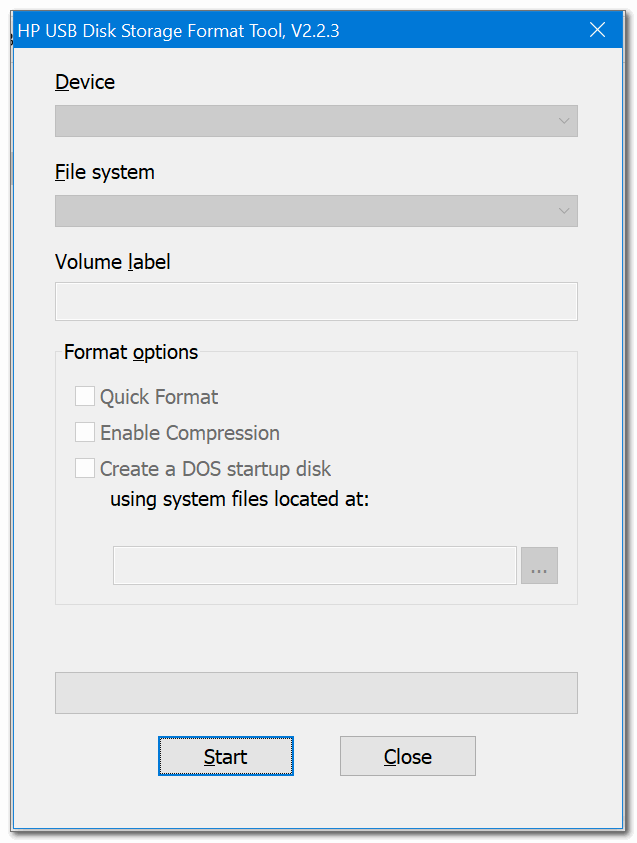
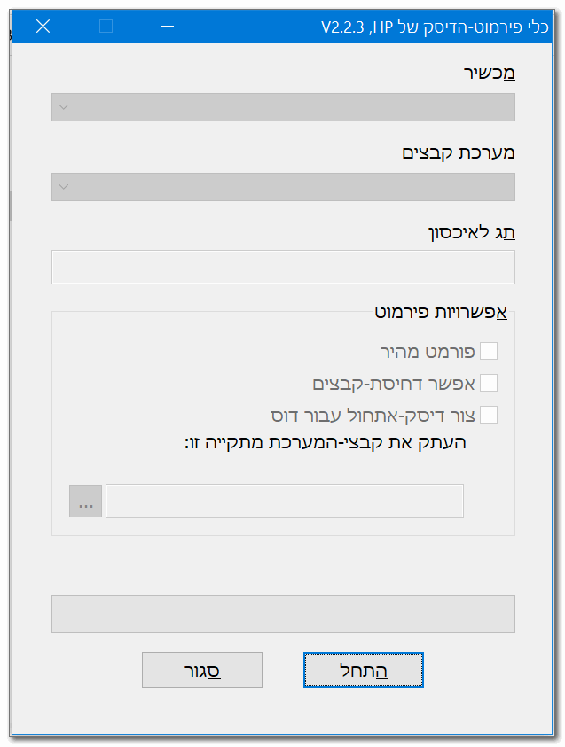

<h1> HPUSBFW - <em>HP USB Disk Storage Format Tool</em></h1>

it is free, portable and without any installation needed,
This is the latest known version of <code>HPUSBFW.exe</code>: <code>2.2.3.0</code> with several manifest fixes, 
<em>so now.. <code>2.2.3.1</code>...</em>.

 

I've also included a Hebrew-translated version of the exe: <code>HPUSBFW_HEBREW.exe</code>.

 

This program originally shipped along with bios upgrades, 
to help format a DOS-boot-capable storage (either hard-drive, floppy disk or a USB mass-storage device),
it is very popular since it allows to format a FAT16 or FAT32 driver With <a href="https://en.wikipedia.org/wiki/Master_boot_record">MBR</a>,
which allows later the usage of Grub (or Grub4DOS) to be installed and make USB devices into a bootable "rescue disks",
this allows allows installation of OS on clean PC with no need for DVD-installation drives present (some newer laptops don't includes those..).

this is here just for reference (hard to find this software now days),  
there are much better alternatives (Rufus, for example).